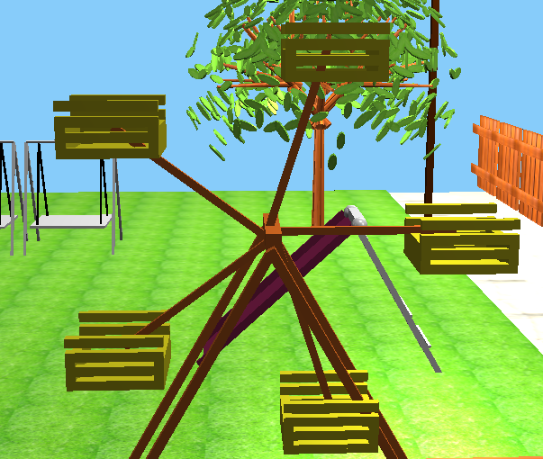
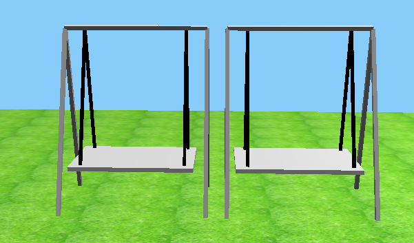
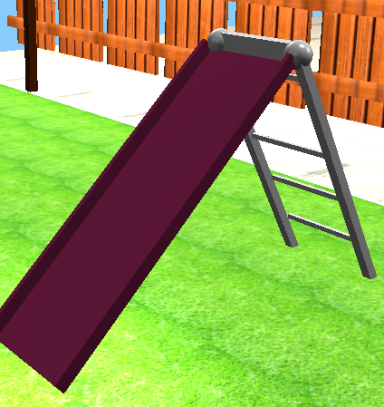
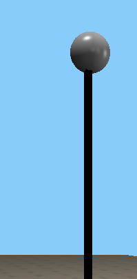
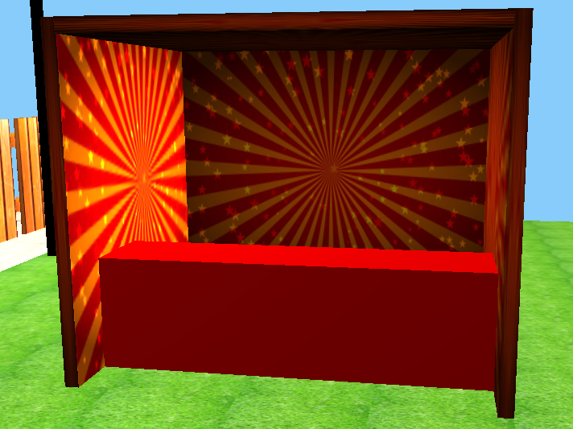
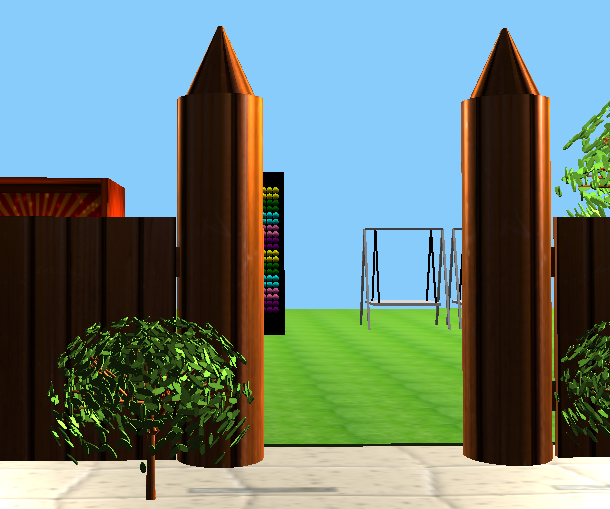
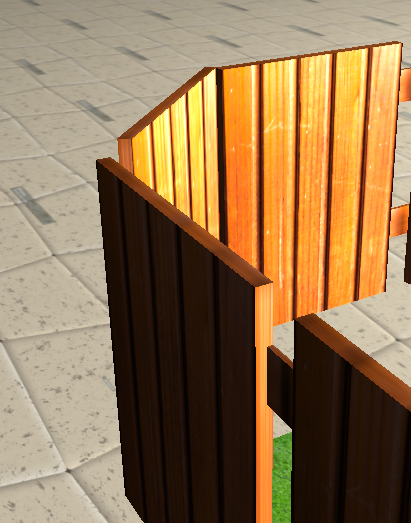
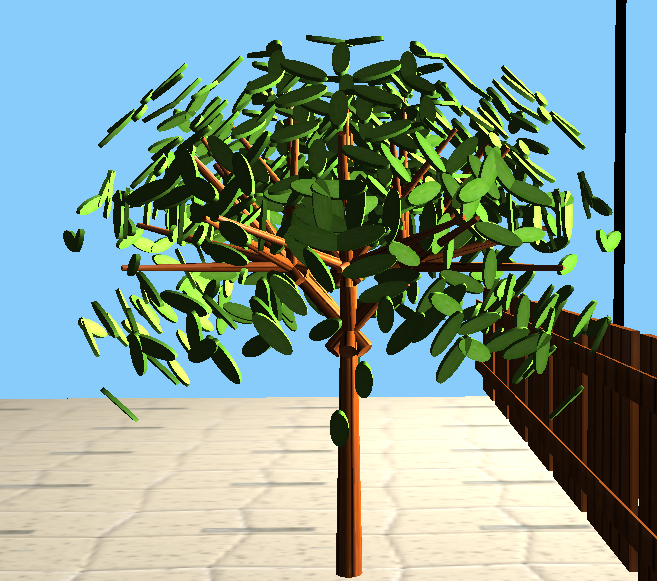
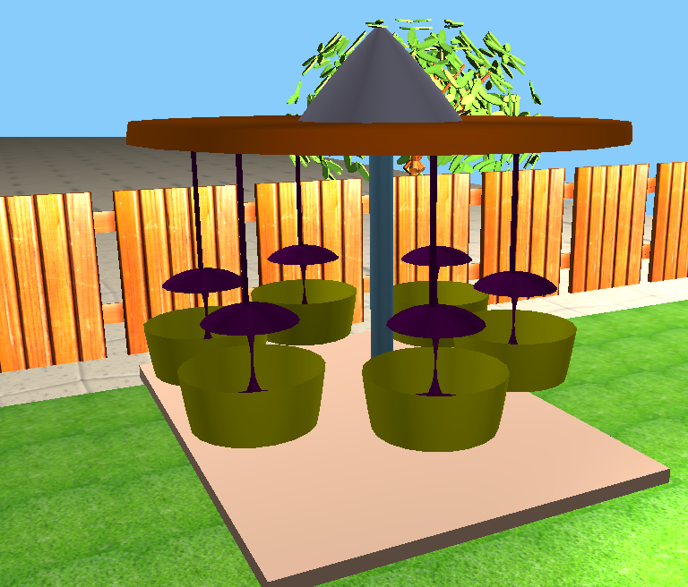
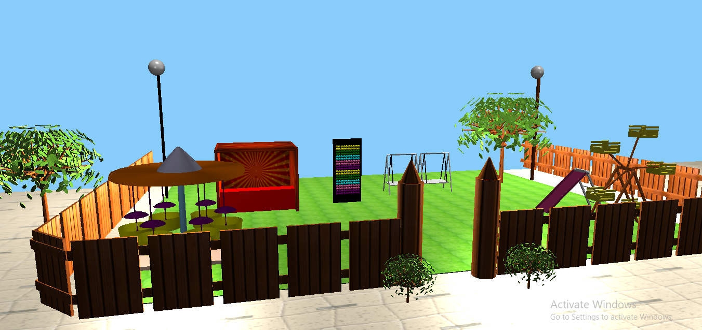

# Mini-Park — Graphics Project  

This is a Computer Graphics Lab project built using OpenGL and C++.  
The project simulates an amusement park with interactive camera movement, lighting effects, and animated rides.

## Keyboard Controls  

### Camera Movement  
- `W` - Move forward  
- `S` - Move backward  
- `A` - Move left  
- `D` - Move right  
- `E` - Move up  
- `R` - Move down  
- `X` - Pitch up  
- `C` - Pitch down  
- `Y` - Yaw left  
- `V` - Yaw right  
- `Z` - Roll left  
- `Q` - Roll right  

### Lighting Controls  
- `1` - Toggle directional light  
- `2` - Turn on all point lights  
- `3` - Turn off all point lights  
- `4` - Toggle spotlight  
- `5` - Turn on spotlight  
- `6` - Turn off spotlight  
- `7` - Enable diffuse lighting  
- `8` - Enable specular lighting  
- `9` - Enable ambient lighting  
- `0` - Enable specular lighting  

### Object Toggles  
- `F` - Toggle "Nagordola" (Ferris wheel)  
- `G` - Toggle "Dolna" (Swing)  

### Environment Toggles  
- `O` - Set night mode (turn on specific lights)  
- `P` - Disable night mode (turn off specific lights)  

### Exit  
- `Esc` - Close the application  

---

## Screenshots  

### Ferris Wheel (Nagordola)  
  
  

### Swing & Slider  
  
  

### Lighting & Effects  
  
  

### Park Elements  
  
  
  
  
  

### Ride Animation & Effects  
  
  

### Overview of Mini-Park  
  

---

## How to Run  
1. Clone the repository:  
   ```sh
   git clone https://github.com/samin078/Mini-Park.git
